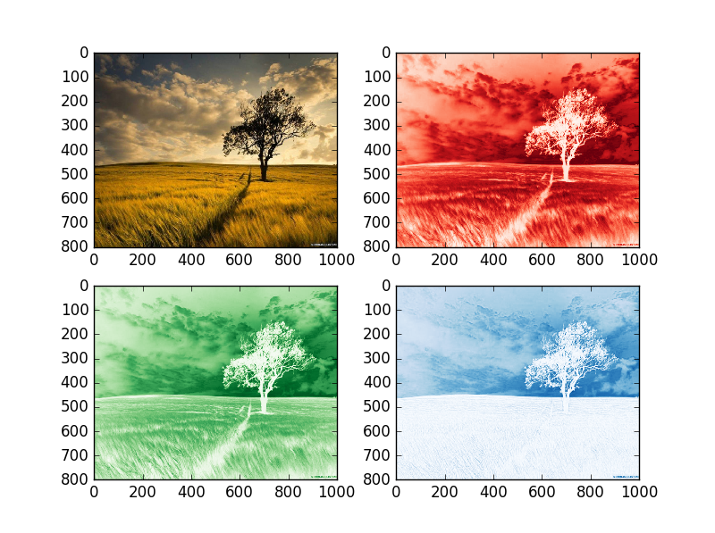

UECM3033 Assignment #2 Report
========================================================

- Prepared by: ** Yang Guang Tsong **
- Tutorial Group: T2

--------------------------------------------------------

## Task 1 --  $LU$ Factorization or SOR method

The reports, codes and supporting documents are to be uploaded to Github at: 

[https://github.com/your_github_id/UECM3033_assign1](https://github.com/your_github_id/UECM3033_assign1)

Explain your selection criteria here.

The condition is set to be np.count_nonzero(A) > 1/2*len(A). If the none zero elements in matrix A is greater than half of the length of matrix A, it will perform LU factorization, else it will perform SOR method. 

Explain how you implement your `task1.py` here.

First of all, we make a self-defined funtion lu. It is for solving the LU. Then, we make another self-defined duntion sor. We set a iteration limit as 10 and initiate omega as 1.03. The length of A is use len.
Sparse matrix is a matrix which the most elements are zero. If the matrix is most consist of most zero matrix, it is more accurate that use SOR to solve it. We use np.array to make the A and b to be a matrix, and use astype float to convert it to float. Then, used np.linalg.solve(A,b) and solve(A,b) to check with the condition. Use print() to display the answer. 

---------------------------------------------------------

## Task 2 -- SVD method and image compression

Put here your picture file (tree.jpg)

 

How many non zero element in $\Sigma$?

There are 800 non zero elements in red matrix, 800 non zero elements in green matrix, and 800 non zero elements inblue matrix. 

Put here your lower and better resolution pictures. Explain how you generate
these pictures from `task2.py`.

high resolution

low resolution

First of all, we create a self-defined function svd(). Then, seperate it into 3 different matrix, red(r)r, green(g) and blue(b). Then, we calculate the nonzero element inside each matrix. )After that,  keep the first n nonzero element in each matrix and set the rest of the entries to zero. Each of the r,g and b is a 3 dimension matrix. The original of each matrix is (800,1) and we need to convert it to (800,1000) in order to do dot multiplication for new matrix,so the new matrix of dimension of (800,1000). Then, we plot 4 picture which the first picture was the original picture and the each other picture was poltted by only red or blue or green. Finally, we set the degree of resolution we want and sub into funcyion svd().

What is a sparse matrix?

A sparse matrix is a matrix in which most of the elements are zero. By contrast, if most of the elements are nonzero, then the matrix is considered dense. Sparse matrices also have significant advantages in terms of computational efficiency such as reduction in required storage space. For example, we make use of sparse matrix in task 2 in order to make the lower resolution picture.

-----------------------------------

last modified: change your date here
